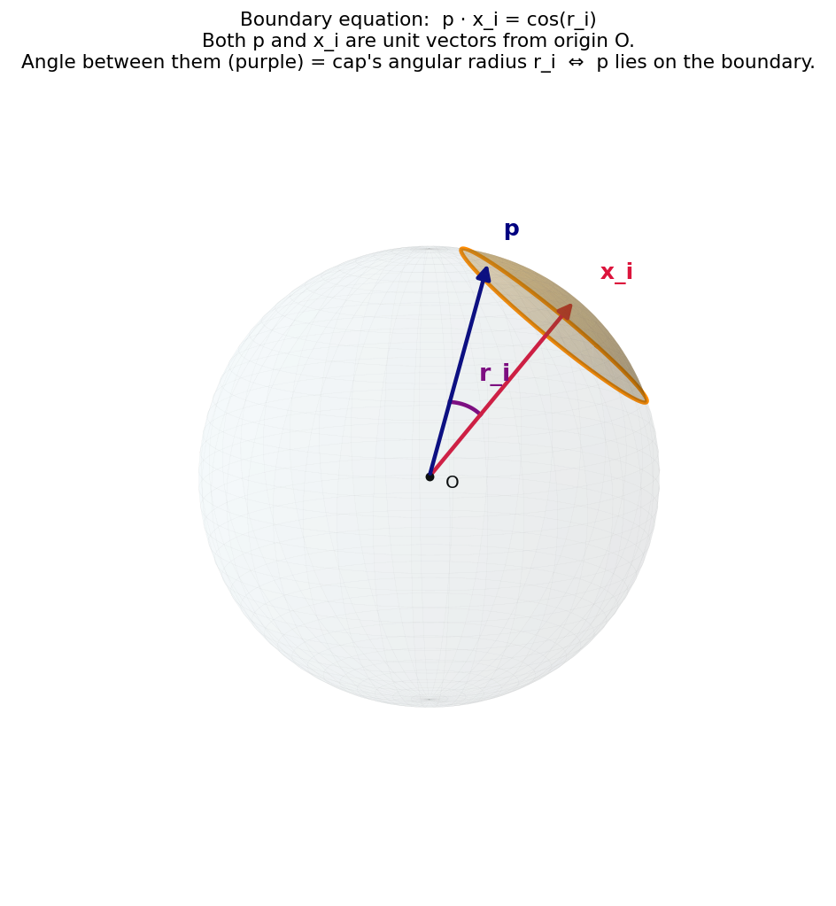
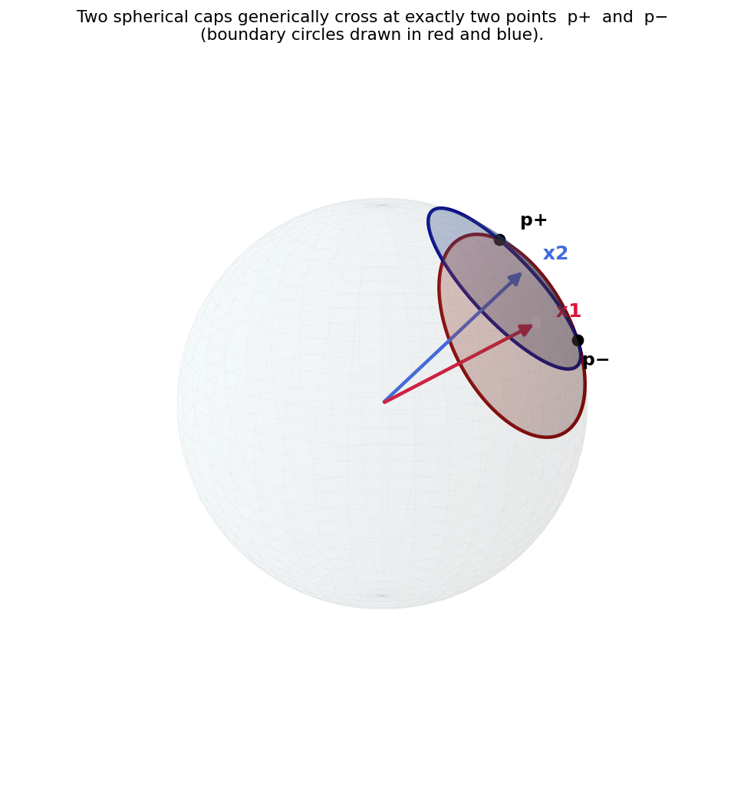
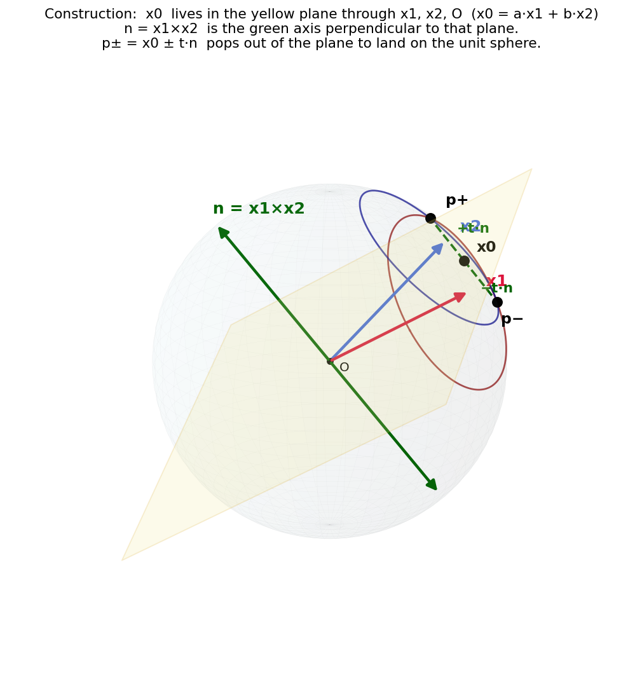

# Spherical two-circle intersection — how `circle_intersections` finds crossings

**Date:** 2026-05-19
**Code:** [scripts/framework/geometry.py:312-388](../scripts/framework/geometry.py#L312-L388) (`circle_intersections`)
**Visualization script:** [scripts/visualization/mtl/circle_intersections/plot_circle_intersections.py](../scripts/visualization/mtl/circle_intersections/plot_circle_intersections.py)
**Figures:** [assets/2026-05-19-circle-intersections/](assets/2026-05-19-circle-intersections/) (copied from [scripts/visualization/mtl/circle_intersections/outputs/](../scripts/visualization/mtl/circle_intersections/outputs/))

## What this function does

Given a list of CBG circles on the Earth (each a `(lat, lon, rtt, d_km, r_rad)` tuple), `circle_intersections` returns the vertices of the feasible intersection polygon — i.e. the set of points that lie on at least two circle boundaries **and** inside every disk. The hard part is the per-pair computation: given two spherical caps, find where their boundary circles cross. This note explains that closed-form derivation.

Everything below treats Earth as a unit sphere; radii are angular (radians), with `r_i = d_km / EARTH_RADIUS_KM` per [geometry.py:248](../scripts/framework/geometry.py#L248).

## The boundary equation



A point `p` lies on cap `i`'s boundary circle iff

```
p · x_i  =  cos(r_i)
```

where `x_i = geo_to_cartesian(lat_i, lon_i)` is the unit vector pointing from Earth's center to the cap's center, and `r_i` is the cap's angular radius.

Three small facts chained together:

1. **Points on the sphere are unit vectors.** Every location on the (unit) sphere is the tip of a length-1 vector from the origin.
2. **Cap radii are angles, not km.** A spherical cap is "all points within angle `r_i` of `x_i`" as seen from the origin.
3. **Dot product of two unit vectors = cosine of the angle between them.** So `p · x_i = cos(θ)`, and the boundary is exactly the locus where `θ = r_i`.

In the figure: red arrow = `x_i`, blue arrow = `p` on the boundary, purple arc at the origin = the angle `r_i` between them. The orange disk on the sphere is the cap; the dark-orange ring is its boundary circle.

## Two caps cross at two points



For two non-tangent caps with distinct centers, the boundary circles generically intersect at exactly two points on the sphere — call them `p+` and `p−`.

`p+` and `p−` lie on the boundary of *both* caps, so they each satisfy two scalar equations plus the unit-sphere constraint:

```
p · x1  =  cos(r1)
p · x2  =  cos(r2)
|p|²    =  1
```

That's a 3-equation system in 3 unknowns. Two of them are linear; one is quadratic. We expect ≤ 2 solutions — exactly the two crossings.

## The construction: `x0`, `n`, and `±t·n`



The trick that makes a closed form possible: decompose `p` into a part lying **in the plane through `x1`, `x2`, and the origin** plus a part lying **perpendicular** to that plane.

```
p  =  ( a·x1 + b·x2 )  +  t·n
       └─────┬─────┘      └─┬─┘
             x0           offset
```

where `n = x1 × x2` is the normal to the plane.

The yellow plane is the plane through `O`, `x1`, `x2`. `x0` is the black dot inside the plane. The green axis is `n`, perpendicular to the plane. The dashed segments `±t·n` step from `x0` out of the plane to land on the sphere — those landing points are `p+` and `p−`.

### Solving for `a, b` (the in-plane part)

`n` is perpendicular to both `x1` and `x2`, so `n · x_i = 0`. Substituting into the two linear constraints, the `t·n` term drops out:

```
x0 · x1  =  cos(r1)
x0 · x2  =  cos(r2)
```

With `x0 = a·x1 + b·x2` and `q = x1·x2`:

```
a + b·q  =  cos(r1)
a·q + b  =  cos(r2)
```

A 2×2 linear system. Solving:

```
a = ( cos(r1) − q·cos(r2) ) / (1 − q²)
b = ( cos(r2) − q·cos(r1) ) / (1 − q²)
```

This is [geometry.py:352-353](../scripts/framework/geometry.py#L352-L353). The denominator `1 − q²` blows up iff `q = ±1`, i.e. the centers are **coincident or antipodal** — degenerate cases caught by the `abs(denom) < 1e-12` guard at [line 349](../scripts/framework/geometry.py#L349).

### Solving for `t` (the out-of-plane step)

Now use `|p|² = 1`. Because `x0 ⊥ n`, the cross term `2 t (x0·n)` vanishes:

```
1 = |x0 + t·n|² = |x0|² + t²·|n|²
                            1 − |x0|²
            ⇒    t² = ─────────────────
                              |n|²
```

That's `val` at [line 361](../scripts/framework/geometry.py#L361). If `val ≤ 0` the would-be midpoint is *already outside* the unit sphere — geometrically the two cap boundaries don't actually meet, and the pair contributes no vertices.

### Emitting the two crossings

```python
for sign in (1, -1):
    point = x0 + sign * t * n     # one of p+, p−
    # convert unit vector (x, y, z) back to (lat, lon)
```

— [geometry.py:366-372](../scripts/framework/geometry.py#L366-L372). The `±` accounts for both intersection points; they sit symmetrically on opposite sides of the yellow plane.

## Code-to-picture map

| Code | Picture element |
|---|---|
| `x1, x2 = geo_to_cartesian(...)` | red and blue arrows from `O` |
| `q = np.dot(x1, x2)` | cosine of the angle between the arrows |
| `a, b` formulas | coordinates of `x0` in the (`x1, x2`) basis |
| `x0 = a·x1 + b·x2` | the black dot inside the yellow plane |
| `n = np.cross(x1, x2)` | the green axis perpendicular to the plane |
| `t = sqrt((1 − \|x0\|²) / \|n\|²)` | how far along `n` to step to land on the sphere |
| `point = x0 ± t·n` | the two black dots `p+`, `p−` |

## Degeneracies handled

- **Coincident centers / antipodal centers** (`abs(1 − q²) < 1e-12`): no unique intersection; skip the pair. [line 349](../scripts/framework/geometry.py#L349)
- **Degenerate cross product** (`|n|² < 1e-12`): same condition expressed via the normal axis. [line 358](../scripts/framework/geometry.py#L358)
- **Boundaries don't actually meet** (`val ≤ 0`): one cap strictly contains the other or they're disjoint; skip. [line 362](../scripts/framework/geometry.py#L362)
- **Single circle in the input**: skip the pairwise algebra and return 4 evenly spaced sample points on the boundary via `get_points_on_circle`. [line 335-337](../scripts/framework/geometry.py#L335-L337)

## After the per-pair computation: feasibility filter

The pairwise crossings are only **candidate** vertices. The CBG feasible region is the intersection of *all* caps, so the loop at [lines 374-382](../scripts/framework/geometry.py#L374-L382) keeps a candidate only if `haversine(center_c, point) ≤ d_c` for **every** disk `c`. What survives is exactly the set of polygon vertices — empty if the caps have no common intersection.

## Mental model

For each pair of circles, `x0` is the **midpoint of the chord joining `p+` and `p−`**. That chord is perpendicular to the plane spanned by the two cap centers. So the algorithm:

1. Locate the chord's midpoint in the centers' plane (gives `a, b, x0`).
2. Find the chord's direction perpendicular to the plane (gives `n`).
3. Step ±half-chord-length to recover the endpoints (gives `t`, then `x0 ± t·n`).

Identical structure to two flat circles intersecting in 2D, just promoted to the sphere by reinterpreting "the line joining centers" as "the plane through centers and origin," and "perpendicular direction" as "the cross-product axis."

## Reproducing the figures

```
python -m scripts.visualization.mtl.circle_intersections.plot_circle_intersections
```

Writes three PNGs into [scripts/visualization/mtl/circle_intersections/outputs/](../scripts/visualization/mtl/circle_intersections/outputs/).
