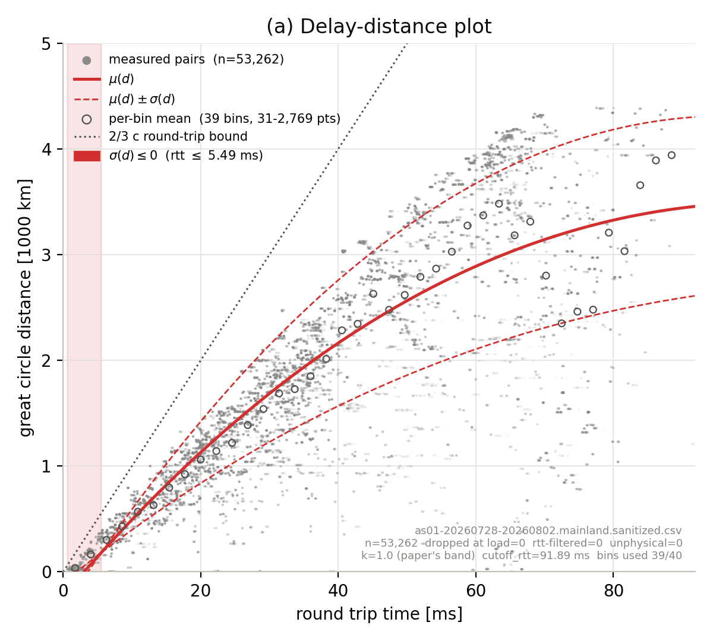
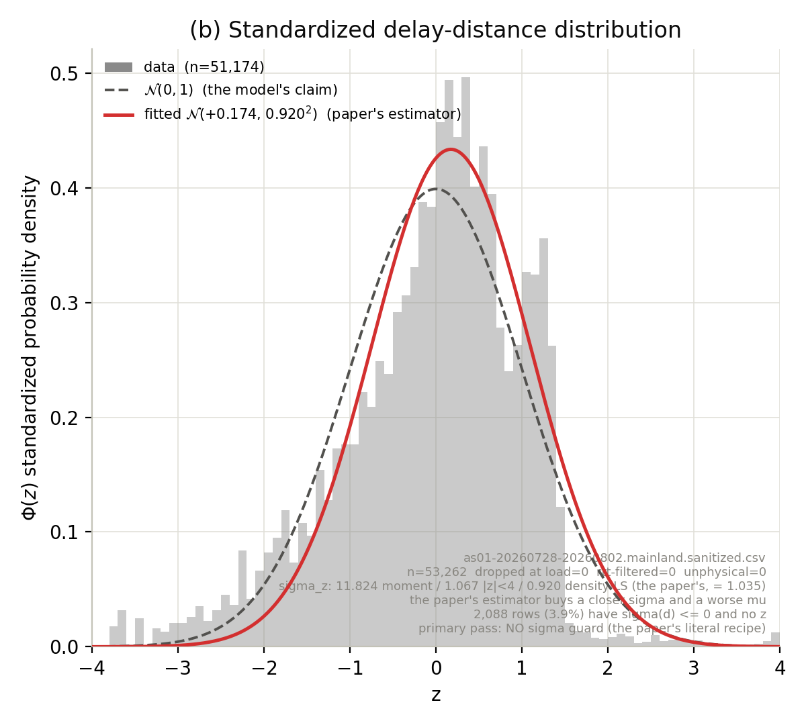
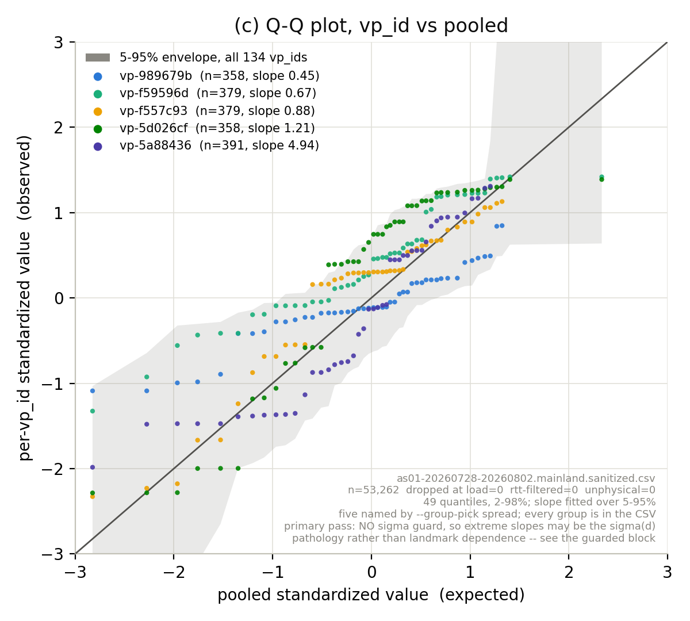
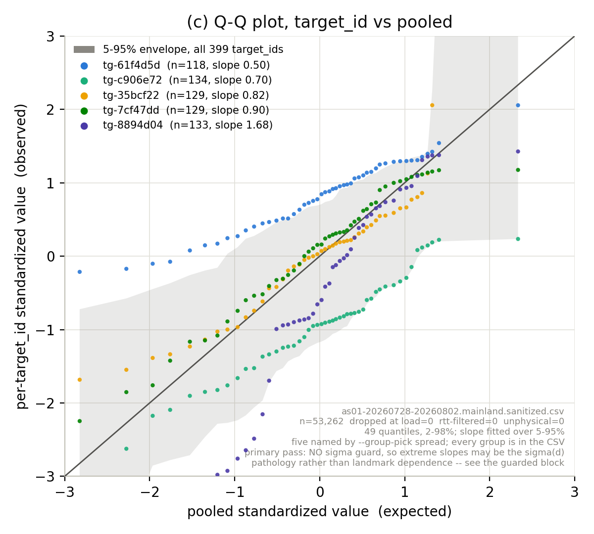

# Spotter normality check on the operator meshes (as01/02/03)

**Date:** 2026-09-18
**Source paper:** Laki et al., *Spotter: A Model Based Active Geolocation Service*, 2011.
**Script:** [scripts/analysis/v3/modules/figure_spotter_normality.py](../scripts/analysis/v3/modules/figure_spotter_normality.py) (`plot-spotter-normality`)
**Figures:** [assets/2026-09-18-spotter-normality-operator-mesh/](assets/2026-09-18-spotter-normality-operator-mesh/)
**Complements, does not replace:** [2026-05-17-spotter-normality-check.md](2026-05-17-spotter-normality-check.md) (the RIPE Atlas arm)
**Why it fails, argued:** [2026-09-19-normal-dist-wrong-for-operator-hypergiant.md](2026-09-19-normal-dist-wrong-for-operator-hypergiant.md)
— this note is the measurement; that one is the four-part case that a pooled
normal is the wrong model family for this regime.

## Summary

Spotter makes two claims. On clean single-tier operator data they come apart:

| Claim | Verdict |
|---|---|
| `f_d(s)` is normal once standardized (`mu ~ 0`, `sigma ~ 1`) | **Moments hold**, `sigma_z` 1.005-1.046, vs the paper's 1.035. **Shape does not** — skew −0.57 to −0.65 on all three, KS D 11-13x its 5% critical value. |
| `f_d` is **landmark-independent** | **Rejected on all three.** Per-landmark mean `z` spreads 2.5-6.2x wider than an RTT-stratified permutation null (p = 0.005, the floor at 200 draws); landmark identity explains 10-31% of `Var(z)`. |

And one thing the paper could not have seen, because it never fitted outside
0-80 ms: **the fitted `sigma(d)` is negative inside the calibration range** on
all three datasets, which makes the deployed `normal_dist` LTD return a
degenerate band at low RTT.

## Why re-run this on the operator meshes

The May note tested Spotter on RIPE Atlas `ping_10k_to_anchors` and concluded
landmark-independence fails there. Auditing that script against the paper
turned up four misalignments (§"What was wrong with the Atlas arm"), the worst
being that it grouped the Q-Q plot on the **target** while the paper's claim is
about the **landmark that performed the measurement** (Sec. III; Fig. 3c's
caption reads "Q-Q plot for five selected landmarks").

`datasets/final/as0{1,2,3}-20260728-20260802.mainland.sanitized.csv` fix that
by construction, and they match the paper's regime far better than Atlas does:

| | Spotter (PlanetLab) | as01 | as02 | as03 |
|---|---|---|---|---|
| Measurements | ~40,000 | 53,262 | 54,990 | 61,293 |
| RTT range | 0-80 ms | 0.58-91.9 | 0.71-92.4 | 0.62-92.4 |
| Max distance | ~5,000 km | 4,384 km | 4,384 km | 4,384 km |
| Population | one connectivity tier (research LAN → NREN) | single ASN (7018), single country (US) | same | same |
| Landmark / target roles | symmetric mesh | **deterministic** (VP measures, target is measured) | same | same |
| Landmarks | not stated (~200 implied) | 134 ids / 87 coordinates | same | same |

`rtt_ms` is real measured min-RTT, recovered exactly (max abs error 1.4e-14) by
inverting a linear RTT→km transform — **not** derived from distance. Provenance
in `datasets/final/*.reconstruction.json`; the concern is worth naming because
these CSVs are reconstructions, and a distance-derived RTT would have made the
whole exercise circular.

## Claim 1: the normal fit



Panel (a) is qualitatively the paper's Fig. 3a with one difference worth
recording: **our `mu(d)` is concave and theirs is convex.** Theirs accelerates
from ~28 km/ms below 30 ms to ~62 km/ms at 75 ms; ours rises steeply and then
saturates near 3,450 km as the mainland-US target set runs out of geography.
Same functional form, opposite curvature, for a mundane reason — they stopped
at 80 ms and 5,000 km, we reach the edge of the continent.



Panel (b) carries **both** normals, as the paper's own figure does: dashed
`N(0,1)` (what the model claims) and solid `N(mu_hat, sigma_hat)` from a
least-squares fit to the density (the paper's estimator — see §"Which sigma").

| | as01 | as02 | as03 | paper |
|---|---|---|---|---|
| `sigma_z` untruncated moment | 1.046 | 1.038 | 1.005 | — |
| `sigma_z` moment, \|z\| < 4 | 1.040 | 1.030 | 0.976 | — |
| `sigma_z` density LS fit | 0.911 | 1.034 | 0.941 | **1.035** |
| `mu_z` moment | −0.070 | +0.071 | +0.033 | **−0.078** |
| skew | −0.75 | −0.57 | −0.65 | not reported |
| excess kurtosis | +0.81 | −0.00 | +0.09 | not reported |
| KS D vs the fitted normal / its 5% critical value | 12.6x | 11.2x | 12.5x | not reported |

(All from the guarded pass — see §"The sigma(d) ≤ 0 problem" for why the
unguarded `sigma_z` reads 6-20 instead. as02 and as03's panels are beside
as01's in the asset directory:
[as02](assets/2026-09-18-spotter-normality-operator-mesh/as02-fig3b.png),
[as03](assets/2026-09-18-spotter-normality-operator-mesh/as03-fig3b.png), and
their scatters
[as02](assets/2026-09-18-spotter-normality-operator-mesh/as02-fig3a.png),
[as03](assets/2026-09-18-spotter-normality-operator-mesh/as03-fig3a.png).)

So the first-order answer is **yes**: on a homogeneous single-ASN fleet at
PlanetLab-comparable scale, the pooled normal reproduces the paper's moments
closely. This is the operator-mesh analogue of the May note's anchors-meshed
result, and it lands in the same place.

But the moments are not the distribution. Panel (b) shows a consistent left
tail and a hard right shoulder around `z = +1.5`: the residual cannot exceed
the distance to the far edge of the target footprint, so the upper tail is
truncated by geography while the lower tail is not. Skew ≈ −0.6 on all three is
that asymmetry, and it is invisible in `(mu, sigma)`. **Reporting `sigma_z ≈ 1`
as "the normal holds" is the mistake this panel exists to prevent.**

Two shape notes against the May note: the Atlas arm's **leptokurtosis does not
transfer** (as02 and as03 come out essentially mesokurtic, +0.00 and +0.09), and
neither does its mechanism story — there is no consumer-access population here
to mix.

## Claim 2: landmark-independence, as a number



Panel (c) is the load-bearing one. Five VPs are named — chosen as the min, p25,
median, p75 and max by Q-Q slope, so the selection brackets the worst case
rather than curating it, unlike the paper's editorial "five selected landmarks…
considered to represent the whole landmark set well" — and **all 134 are drawn
behind them as a 5-95% envelope**.

The five fan off the diagonal with slopes from 0.45 to 4.94 and visible
horizontal offsets. On the paper's data these curves sat on the diagonal. Same
picture on
[as02](assets/2026-09-18-spotter-normality-operator-mesh/as02-fig3c.png) and
[as03](assets/2026-09-18-spotter-normality-operator-mesh/as03-fig3c.png).

Reading the slope: pooled is on **x** here, so `slope = sigma_group /
sigma_pooled` and a group narrower than pooled sits below the diagonal. The
Atlas script draws the axes the other way round, which inverts it — see the
corrections below.

Quantitatively, per dataset (guarded pass, grouping on `vp_id`):

| | as01 | as02 | as03 |
|---|---|---|---|
| sd across landmarks of mean `z` | 0.345 | 0.576 | 0.388 |
| RTT-stratified permutation null, p50 | 0.135 | 0.101 | 0.063 |
| **observed / null** | **2.5x** | **5.7x** | **6.2x** |
| permutation p (200 draws) | 0.005 | 0.005 | 0.005 |
| `eta^2` — share of `Var(z)` explained by landmark identity | 10.8% | 30.7% | 14.9% |
| Q-Q slope, p25-p75 | 0.68-1.15 | 0.70-0.90 | 0.79-1.00 |
| Levene (median-centred) p across landmarks | 0.0 | 0.0 | 0.0 |

The null needs a word. Under iid sampling a 400-row group would show a mean-`z`
spread of `1/sqrt(400) ≈ 0.05`, which would make this a 7-12x rejection — but
that figure is invalid here, because a landmark's ~400 observations come from
≤23 distinct target coordinates and are strongly correlated through that shared
geometry. The permutation null relabels the landmark **within RTT bins**,
preserving each group's per-bin counts, which both respects that correlation
and strips out the RTT-coverage confound (a landmark that only measures short
RTTs would differ in mean `z` from one that measures long RTTs even under a
perfectly landmark-independent law, because `mu(d)` has structure in its
residuals). The measured null of 0.06-0.14 is 1.3-2.7x the naive figure, so the
correction matters; the rejection survives it comfortably.

### The target side carries more structure than the landmark side

Same dataset (as01), four groupings:

| `--group-by` | groups | sd of mean `z` | null p50 | observed / null | `eta^2` |
|---|---|---|---|---|---|
| `vp_id` (the paper's landmark) | 134 | 0.345 | 0.135 | 2.55x | 10.8% |
| `vp_coord` | 87 | 0.352 | 0.128 | 2.74x | 10.2% |
| `target_id` | 399 | 0.518 | 0.136 | **3.80x** | 25.5% |
| `target_coord` | 20 | 0.505 | 0.104 | **4.87x** | 23.1% |

Use the ratio column, not the raw spread or `eta^2`: both of those grow with the
number of groups, so 399 target ids and 134 VP ids cannot be ranked by them.
Each null is drawn at its own grouping's group count, so the ratio can be.



Collapsing ids onto coordinates barely moves either side (2.55 → 2.74,
3.80 → 4.87), so this is site structure, not per-instance noise.

This is worth stating carefully because it is the opposite of the Atlas
finding. There, a heterogeneous probe fleet measured well-connected anchors and
the **source** side dominated. Here the source fleet is one ASN in one country
and the **target** side dominates — ~20 distinct customer sites with their own
access and routing. Neither result generalizes to "it's always the probes" or
"it's always the targets": **whichever endpoint population is more
heterogeneous is the one that breaks the pooled model**, and Spotter's claim
holds only when both are homogeneous. Their PlanetLab mesh had the same nodes
on both ends, which is the strongest version of that condition.

## The sigma(d) ≤ 0 problem

`mu(d)` and `sigma(d)` are unconstrained polynomials fitted to per-bin moments
with **equal weight per bin regardless of bin count**. On as01 the bins carry 31
to 2,769 points, so the sparse leftmost bin weighs as much as the modal one, and
the degree-2 `sigma` polynomial is dragged below zero *inside the range it was
fitted on*:

| | as01 | as02 | as03 |
|---|---|---|---|
| `sigma(d)` root | 5.507 ms | 2.220 ms | 2.398 ms |
| rows with `sigma(d) ≤ 0` | 2,088 (3.9%) | 444 (0.8%) | 565 (0.9%) |
| `mu(rtt_min)` | **−184 km** | +238 km | +95 km |
| dropped rows' median distance | 69 km | 27 km | 24 km |
| kept rows' median distance | 1,773 km | 1,648 km | 1,797 km |
| unguarded `sigma_z` | 11.82 | 19.69 | 6.05 |
| guarded `sigma_z` (`sigma > 50 km`) | 1.046 | 1.038 | 1.005 |

Three things follow.

**The drop is biased, not just large.** The affected rows have median distance
24-69 km against 1,600-1,800 km for the rest — they are the near-target pairs a
geolocation system is judged on. The Atlas script drops them silently
(`standardize()` returns a shorter array than its input with no count), which is
how a 3.9% loss of exactly the most interesting rows stayed invisible.

**The unguarded `sigma_z` is an artifact.** Rows just right of the root divide by
a near-zero sigma, so a handful of them set the moment. Anyone comparing 11.82
to the paper's 1.035 would conclude the model has collapsed; anyone comparing
the ±4-truncated 1.040 would conclude it is fine. Both are reading the same
pathology. The command reports all three estimators and the guarded pass for
exactly this reason.

**The deployed model inherits it.** `predict_distance_bounds` builds
`outer = max(0, mu + k*sigma)` and `inner = max(0, mu - k*sigma)`, so where
sigma is negative the band inverts, and where `mu + sigma ≤ 0` it collapses to
`(0, 0)` — which `normal_dist.py:161` maps to `Error.DEGENERATE_REGION`. On as01
that is RTT ≤ 3.64 ms: **`spotter_cbg` declines those VP-target pairs outright
and the VP stops participating in the MTL.** as02 and as03 keep `mu > 0`, so
they get the subtler version, an inverted band with neither end clipped.

Pinned as a library test:
`test_sigma_polynomial_can_go_negative_inside_the_calibration_range` in
[test_spotter_model.py](../scripts/libs/spotter/test_spotter_model.py).

Independent corroboration: the in-progress density-MTL work on
`SpotterRTTModel.predict_mu_sigma` already has to return `None` when sigma is
non-positive, for the same reason. Two consumers now work around this
polynomial rather than one.

### What fixes it, and what does not

Restricting to the paper's own 0-80 ms range (692 rows, 1.3%) **removes the sign
error**: no root in range, zero rows dropped. It does not remove the
near-zero-sigma blow-up — `sigma(rtt_min)` is then +0.4 km and the unguarded
`sigma_z` is still 3.74. So the sparse high-RTT tail causes the sign flip and
the low-RTT edge causes the small-sigma problem; they are two defects, and the
paper's range only escapes the first.

The structural fix is to fit `log sigma` instead, which is positive by
construction — measured at `sigma_z` 1.149 / 1.203 / 1.052 with zero rows
dropped. That changes what `normal_dist` deploys and so needs its own benchmark
run; filed as a follow-up, not done here. Cross-reference
[2026-09-18-spotter-mtl-fidelity-gap.md](2026-09-18-spotter-mtl-fidelity-gap.md),
which argues `normal_dist` is a faithful Spotter implementation: it is faithful
to the *published recipe*, and this is a case where the published recipe is
numerically unsafe on data the paper never fitted.

## What was wrong with the Atlas arm

Each of these is now guarded by a test in
[test_figure_spotter_normality.py](../scripts/analysis/v3/tests/test_figure_spotter_normality.py).

1. **Q-Q grouped on the target, not the landmark** —
   [spotter_normality_check.py:162](../scripts/libs/cbg_feasibility/spotter_normality_check.py#L162)
   groups by `dst`, which on a probes→anchors table is the measured endpoint.
   The paper's claim is about the measuring one.
2. **RTT range 0-200 ms** against the paper's 0-80
   ([main's `--max-rtt` default](../scripts/libs/cbg_feasibility/spotter_normality_check.py#L198)).
3. **A different sigma estimator than the paper's**, compared as if it were the
   same — [plot_panel_b:143](../scripts/libs/cbg_feasibility/spotter_normality_check.py#L143)
   reports moments truncated to \|z\| < 4 and overlays `N(0,1)`.
4. **Silent drops** — [standardize:115](../scripts/libs/cbg_feasibility/spotter_normality_check.py#L115)
   returns a shorter array than its input with no count.

### Which sigma the paper reported

Its `mu = −0.078, sigma = 1.035` are least-squares fit parameters to the
empirical density, not sample moments. Digitizing Fig. 3b: the red curve peaks
at **0.386 = 1/(1.035·√(2π))**, not at `N(0,1)`'s 0.399, with its mode at
`z = −0.085`. Its green data points peak at ~0.44, so **the paper's own data is
~14% over-peaked against its own fitted curve** — the same kind of deviation the
May note reads as a failure on Atlas data.

Worth knowing before adopting it: on these datasets the paper's estimator buys a
closer `sigma` (0.911-1.034 vs 1.035) and a **worse** `mu` (+0.17 to +0.26 vs
−0.078, where the moment gives −0.07 to +0.07). It is the faithful estimator,
not the flattering one, and that is the only reason to prefer it.

## Limits

`f_d(s)` is a *density* in the paper and a discrete mixture here. Distance can
only take one value per (VP coordinate, target coordinate) pair, so:

| | as01 | as02 | as03 |
|---|---|---|---|
| distinct distances | 1,738 | 1,913 | 2,001 |
| VP coordinates × target coordinates | 87 × 20 | 87 × 22 | 87 × 23 |
| distinct distances per landmark | ≤ 20 | ≤ 22 | ≤ 23 |

Conditioning on an RTT bin selects a subset of those atoms, so the conditional
law of distance given delay is a weighted sum of point masses and its normality
can only ever be approximate. The paper's ~40k PlanetLab pairs spanned ~10^4
distinct geometries — about 5x more, and on both endpoints rather than one.

Three consequences, all reported in the manifest's `caveats` rather than left
implicit: KS p-values are approximate under ties; per-group `z` are not iid,
which is why the permutation reference is required rather than optional; and
panel (c) draws markers rather than lines so the flat runs in each group's ECDF
cannot be read as interpolation.

This discreteness is the price of matching the paper's other conditions (scale,
RTT range, distance ceiling, single tier, deterministic roles). It bounds how
strong a normality verdict can be; it does not affect the landmark-independence
verdict, which is a comparison between groups drawn from the same support.

## Corrections to the May note

- **The Q-Q slope is read backwards there.** It says "slopes through the center
  are < 1 → per-anchor σ is smaller than the pooled σ", and its panel-by-panel
  mechanism repeats that. With observed on x (which is how
  `plot_panel_c` and the paper both draw it) the slope is
  `sigma_pooled / sigma_anchor`, so slope < 1 means per-anchor σ is **larger**.
  This command puts pooled on x so the conventional reading applies.
- **"`mu(d)` shape: near-linear (intra-continental)"** — the paper's `mu(d)` is
  visibly convex, ~28 → ~62 km/ms across 0-80 ms. Its argument that curvature is
  something "their paper sidestepped" has a false premise; the real contrast is
  direction (theirs accelerates, ours saturates).
- **"~100 PlanetLab landmarks"** is not in the paper. It never states the
  calibration landmark count; 40k ordered pairs implies ~200 nodes.
- **The "minimal RTT for each landmark" quote** is from Sec. V-A, describing the
  online service's target measurements — not the Fig. 3a calibration set. Our
  aggregation is a reasonable inference from it, not a stated match.
- **The leptokurtosis mechanism does not generalize.** It is an Atlas finding;
  as02/as03 are mesokurtic.

One thing the May note misses in Spotter's favour: Sec. IV-B's actual
justification for pooling is *sample-size infeasibility* — per-landmark
calibration sets hold "only a few hundred points", so "it is technically
infeasible to infer reliable landmark specific delay models". With ~400
observations per VP these datasets sit exactly on that boundary, and with
thousands per anchor on Atlas the argument does not transfer at all. That is a
stronger basis for the May note's implication 2 (per-VP calibration is warranted
here) than "our Q-Q failed".

## Reproduce

```bash
# All three datasets, one output dir each plus a cross-dataset summary
.venv/bin/python -m scripts.analysis.v3.cli plot-spotter-normality \
    --csv datasets/final/as01-20260728-20260802.mainland.sanitized.csv \
    --csv datasets/final/as02-20260728-20260802.mainland.sanitized.csv \
    --csv datasets/final/as03-20260728-20260802.mainland.sanitized.csv \
    --out-dir /tmp/spotter

# Config-driven, writing to outputs/analysis/v3/<run-id>/spotter-normality/
.venv/bin/python -m scripts.analysis.v3.cli \
    --config configs/as01-260728-260802-mesh.yaml plot-spotter-normality

# The grouping contrast, and the paper's literal RTT range
... plot-spotter-normality --csv <csv> --group-by target_id
... plot-spotter-normality --csv <csv> --rtt-max 80
```

Each run writes `<stem>_spotter_fig3{a,b,c}*.png`, `<stem>_spotter_normality.json`
(the manifest, including every number in this note),
`<stem>_landmark_independence.csv` (one row per landmark, **all** of them, never
a top-N) and `<stem>_bin_fit.csv`.

## Follow-ups

1. `sigma_form="log"` or a `sigma_floor_km` kwarg on `SpotterRTTModel` — fixes
   the degenerate band, changes `spotter_cbg` results, needs its own run.
2. The per-fold arm: fit `mu/sigma` on each fold's train targets and standardize
   the held-out ones. The paper never tested that, and it is what `spotter_cbg`'s
   accuracy actually rests on. `figure_ltd_model.load_fit_samples` already makes
   it a loader plus a loop.
3. Re-run the Atlas arm with the corrected grouping, to see whether its
   conclusion survives being asked about the right endpoint.
