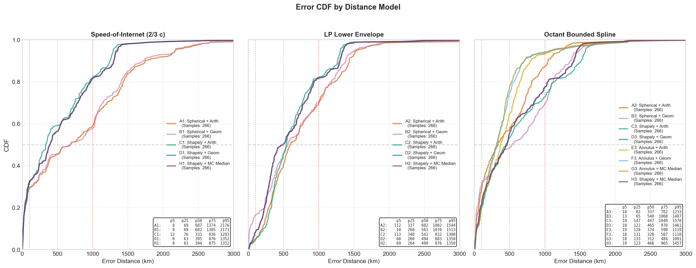

# Benchmarking Constraint-Based Geolocation Variants: Accuracy and Scalability for Internet-Scale IP Geolocation

---

## 1. Project Objective

We propose to conduct the **first systematic benchmark of Constraint-Based Geolocation (CBG) algorithm variants**, covering all three phases of the CBG pipeline across implementations from three landmark papers (original CBG, Million-Scale CBG, Octant). We evaluate each combination on both **accuracy** (error CDF, median error, within-N-km rates) and **scalability** (runtime and memory per IP), motivated by the need to geolocate tens of millions of unicast IPs in mobile operator networks.

Our contributions will be:
1. A three-phase CBG pipeline taxonomy that unifies disparate prior implementations
2. A modular open-source framework implementing all known CBG variants
3. Comprehensive benchmark results on curated RTT datasets from mobile vantage points and RIPE Atlas
4. Practical guidance on which configuration is SOTA and when the accuracy-cost tradeoff favors simpler variants

---

## 2. Motivation

### 2.1 The IP Geolocation Problem for Mobile Operators

Mobile operators observe tens of millions of unique IP addresses communicating with their subscribers daily. Knowing where those IPs are physically located enables:
- Traffic engineering and CDN selection
- Regulatory compliance (geo-restricted content, data sovereignty)
- Anomaly detection (traffic from unexpected geographies)
- Network planning and capacity forecasting

No single geolocation method covers all IPs with high accuracy. A practical multi-tier pipeline combines methods in order of reliability and coverage:

```
Tier 1 — Official:   GeoFeed (RFC 8805), Reverse DNS parsing
Tier 2 — Empirical:  Constraint-Based Geolocation (CBG)
Validation:          Speed-of-Internet violation check
```

CBG outperforms simpler heuristics (GeoPing, GeoCluster) and serves as both the primary prediction layer when declarative methods fail and a validation layer — observed RTTs from vantage points bound where an IP can physically be.

### 2.2 Why Unicast CBG is the Right Starting Point

Unicast IP geolocation with CBG is the most tractable problem:
- Ground truth is available via RIPE Atlas anchors (verified coordinates)
- RTT measurements are available at scale from RIPE Atlas and mobile VPs
- All three reference CBG implementations were designed for unicast
- Benchmarking unicast CBG establishes the baseline before tackling anycast, which requires detecting that the IP is anycast before applying CBG

### 2.3 The Scalability Imperative

Prior CBG evaluations treat geolocation as a research exercise on hundreds of targets. Operating at the scale of a mobile operator (10s of millions of IPs) changes the design constraints fundamentally:

- **Accuracy** matters, but an extra 5% median error reduction that costs 130× more compute is not acceptable at scale
- **Runtime per IP** must be sub-second; a 27-second per-IP method (Monte Carlo median) is infeasible for 50M IPs
- **Memory footprint** for RTT model fitting scales with vantage point count and model complexity
- **Parallelizability** of the pipeline determines whether wall-clock time can be reduced horizontally

This scalability dimension is absent from all prior CBG evaluations.

### 2.4 The Open-Source Gap

Only one public CBG implementation exists: the IMC 2023 replication codebase (Darwich et al.), which re-implements Million-Scale and Street-Level CBG. The original CBG (Gueye et al.) and Octant (Wong et al.) have no public code. This prevents the research community from building on, comparing against, or extending these methods. Our framework fills this gap.

---

## 3. The CBG Pipeline Abstraction

A key insight of this work is that **every published CBG variant can be decomposed into three independent phases**, each with interchangeable implementations. This abstraction enables systematic cross-variant benchmarking for the first time.

```
Input: RTT measurements from N vantage points (VPs) to target IP
          ↓
Phase 1: RTT-to-Distance Modeling
         Convert per-VP RTT → distance constraint (radius or annulus)
          ↓
Phase 2: Multilateration
         Intersect per-VP constraints → feasible region (geometry)
          ↓
Phase 3: Single-Point Estimation
         Collapse feasible region → estimated (lat, lon)
          ↓
Output: Geolocation estimate
```

### Phase 1 — RTT-to-Distance Modeling

| Variant | Source | Method | Output |
|---------|--------|--------|--------|
| **2/3c (Speed-of-Internet)** | Million-Scale (IMC 2012) | Fixed constant: `radius = RTT/2 × 2c/3` | Disk (outer radius only) |
| **LP Low-Envelope** | Original CBG (IMC 2004) | Per-VP linear regression fitted to RTT-distance scatter via LP bestline | Disk (outer radius only) |
| **Bounded Spline** | Octant (NSDI 2007) | Per-VP spline fit + shared delta band calibrated to coverage target | Annulus (inner + outer radius) |

The spline model produces **annuli** rather than disks, encoding both a maximum and minimum distance from each VP — a fundamentally tighter constraint.

### Phase 2 — Multilateration

| Variant | Source | Method | Output |
|---------|--------|--------|--------|
| **Spherical Intersection** | Original CBG / Million-Scale | Pairwise great-circle crossings; keeps points inside all circles | Vertex list |
| **Shapely Polygon Intersection** | — | Approximate circles as 100-point polygons; sequential Shapely intersection | Shapely polygon |
| **Unweighted Annulus Intersection** | Octant | `∩(outer disks) − ∪(inner disks)` | Shapely polygon |
| **Weighted Grid** | Octant | Grid-based weight accumulation over annuli; fused Phase 2+3 | Shapely polygon |

Unweighted annulus intersection is qualitatively different from disk intersection: by subtracting the inner exclusion zones, it removes near-VP regions that are geometrically inconsistent with the RTT constraint — producing a tighter, more accurate feasible region.

### Phase 3 — Single-Point Estimation

| Variant | Source | Method | Complexity |
|---------|--------|--------|-----------|
| **Arithmetic Mean** | Original CBG | Average of intersection vertex coordinates | O(1) |
| **Geometric Centroid** | — | Area-weighted centroid of feasible polygon (Shapely `.centroid`) | O(1) |
| **MC Geometric Median** | Octant | 1000-point Sobol QMC sampling + `geom_median` optimization | O(n_samples) |

The geometric median minimizes sum of distances to all sampled points, making it more robust to irregular polygon shapes. However, it incurs a ~130× runtime penalty versus the geometric centroid.

### Valid Phase Combinations

Not all combinations are valid due to type constraints:
- Annulus multilateration requires the spline distance model (annuli as input)
- Arithmetic mean on vertex lists only works after spherical intersection
- MC median and geometric centroid require a Shapely polygon

We evaluated **18 valid combinations** across these constraints (see Section 6).

---

## 4. Challenges

### 4.1 RTT-Distance Modeling Accuracy

The fundamental challenge of CBG is that the RTT-to-distance mapping is noisy. For an RTT of 20ms, the actual distance can range from 250 to 1100 km. Simple linear models (2/3c) are fast but systematically over-estimate distances in high-latency tails. Per-VP fitted models (LP, spline) are more accurate but require calibration data. The spline model's annulus output captures this uncertainty explicitly — but calibration requires a sufficiently dense set of anchor RTT measurements near the target.

### 4.2 Multilateration Failure (Zero Intersection)

When RTT constraints are noisy or the VP set is poorly chosen, the intersection of distance circles may be empty. All existing methods handle this differently (fallback to nearest VP, centroid of closest circles, barycenter). Consistent failure handling is critical for a fair benchmark and for production use.

### 4.3 Scalability vs. Accuracy Tradeoff

The most accurate CBG configuration (Octant spline + annulus + MC geometric median) achieves 312 km median error but requires ~27s per target due to the 1000-sample Monte Carlo step. At 50M IPs, this is computationally infeasible without massive parallelism. We must characterize the entire Pareto frontier of accuracy vs. cost across all 18 combinations to identify which configurations are viable at scale.

### 4.4 VP Selection and Coverage

CBG accuracy depends heavily on which vantage points are selected and how many. At mobile operator scale, the VP set is fixed (operator's own measurement infrastructure). Unlike academic settings where any RIPE Atlas probe can be used, we must evaluate CBG under realistic VP count and distribution constraints.

### 4.5 Ground Truth Availability

Authoritative ground truth for unicast IPs is difficult to obtain at scale. RIPE Atlas anchors provide verified coordinates for ~500 well-geolocated reference points. For broader evaluation, we rely on IPInfo and MaxMind cross-reference — both of which have known inaccuracies that must be accounted for in result interpretation.

---

## 5. Related Work

### 5.1 Foundational CBG Papers

**Gueye et al., "Constraint-based geolocation of internet hosts"** (IMC 2004 / IEEE/ACM ToN 2006) [[ACM](https://dl.acm.org/doi/10.1145/1028788.1028828)]
Original CBG. Fits a DDR per landmark via linear regression (PlanetLab). Introduces the three-phase structure (modeling → intersection → centroid) that all subsequent CBG variants follow. Defines the LP low-envelope Phase 1 variant and spherical circle intersection Phase 2 variant used as our baselines.

**Wong et al., "Octant: A Comprehensive Framework for the Geolocalization of Internet Hosts"** (NSDI 2007) [[USENIX](https://www.usenix.org/conference/nsdi-07/octant-comprehensive-framework-geolocalization-internet-hosts)]
Replaces the linear DDR with a convex-hull spline model producing annular constraints (inner + outer radius). Adds negative constraints (oceans, uninhabitable areas). Reports 22-mile median error vs. CBG's 89-mile — a 4× improvement. Introduces MC geometric median as the centroid estimator. The source of our bounded spline Phase 1 model and unweighted annulus Phase 2 multilateration.

**Hu et al., "Towards geolocation of millions of IP addresses"** (IMC 2012) [[ACM](https://dl.acm.org/doi/10.1145/2398776.2398790)]
Simplifies to the 2/3c (two-thirds speed of light) model, eliminating the need for per-landmark calibration. Introduces greedy VP selection prioritizing proximity to the target. Scales to geolocate ~35% of the IPv4 address space. The source of our 2/3c Phase 1 baseline.

**Wang et al., "Towards Street-Level Client-Independent IP Geolocation"** (NSDI 2011) [[ACM](https://dl.acm.org/doi/10.5555/1972457.1972494)]
Three-tier refinement from CBG to street-level using landmark discovery and traceroute path analysis. Implemented in this repo; out of scope for the current benchmark (unicast CBG focus).

**Darwich et al., "Replication: Towards a Publicly Available Internet Scale IP Geolocation Dataset"** (IMC 2023) [[ACM](https://dl.acm.org/doi/10.1145/3618257.3624801)]
The only publicly available CBG implementation. Replicates Million-Scale and Street-Level algorithms with RIPE Atlas. Shows that neither technique achieves previously claimed accuracy on today's Internet using public infrastructure. Our benchmark framework extends this codebase.

### 5.2 RTT-Distance Modeling (Phase 1)

**"Modelling of IP Geolocation by use of Latency Measurements"** (IEEE 2015 / arXiv 2020) [[arXiv](https://arxiv.org/pdf/2004.07836)]
Analyzes the correlation between network latency and geographic distance; proposes improved DDR models. Focused on Phase 1 in isolation — no cross-phase benchmark.

**"Dragoon: Advanced Modelling of IP Geolocation by use of Latency Measurements"** (arXiv 2020) [[arXiv](https://arxiv.org/abs/2006.16895)]
Optimized landmark placement via greedy diversification + advanced RTT-distance modulation for European networks. Another Phase 1 improvement without cross-phase evaluation.

**"Delay-Distance Correlation Study for IP Geolocation"** (arXiv 2019) [[arXiv](https://arxiv.org/pdf/1909.02439)]
Systematic empirical study of RTT-to-distance perturbing factors (queueing delay, non-great-circle routing). Provides theoretical grounding for why bounded spline outperforms 2/3c.

All three papers propose Phase 1 improvements in isolation; none benchmarks across variants or phases, confirming the gap this paper addresses.

### 5.3 Official / Declarative Methods (Tier 1 Context)

**"Geofeeds: Revolutionizing IP Geolocation or Illusionary Promises?"** (ACM Networking 2024) [[ACM](https://dl.acm.org/doi/10.1145/3676869)]
Critical large-scale assessment of GeoFeed (RFC 8805/9092) accuracy and adoption promises. Coverage is still limited and accuracy varies significantly by operator.

**"Geofeed Adoption and Authentication"** (IEEE / arXiv 2025) [[arXiv](https://arxiv.org/abs/2502.08849)]
Surveys GeoFeed adoption at RIR and AS level; finds ~7.76% of GeoFeed URLs inaccessible and RFC 9092 authentication lacking. Coverage gaps confirm CBG is needed as a fallback.

**"IP Geolocation through Reverse DNS"** (ACM TOIT 2021) [[ACM](https://dl.acm.org/doi/10.1145/3457611)]
Parses rDNS hostnames to extract location hints; places ~54% of hostnames within 20 km of ground truth. Open-source (Microsoft). Effective for named infrastructure but silent on cloud IPs with opaque hostnames.

These papers motivate the multi-tier pipeline: GeoFeed and rDNS coverage failures make CBG necessary as an empirical fallback.

### 5.4 Commercial Geolocation Accuracy / Criticism

**"Accuracy and Coverage Analysis of IP Geolocation Databases"** (IEEE 2023) [[IEEE](https://ieeexplore.ieee.org/document/10167899/)]
Cross-database accuracy study (MaxMind, DBIP, IP2Location, IPGeolocationIO) over the full IPv4 space. Mobile and cloud IPs are systematically under-served.

**"IP geolocation databases: unreliable?"** (ACM CCR 2011) [[ACM](https://dl.acm.org/doi/10.1145/1971162.1971171)]
Early influential demonstration of large median errors and frequent gross mislocations in commercial databases.

**"GPS-Based Geolocation of Consumer IP Addresses"** (PAM 2022) [[ACM](https://dl.acm.org/doi/10.1007/978-3-030-98785-5_6)]
Uses GPS-tagged user requests as ground truth to evaluate commercial services. Finds significant errors for mobile and residential IPs.

Commercial services are opaque, inaccurate on mobile IPs, and unauditable — motivating an open, measurement-based alternative.

### 5.5 Recent Adjacent Work

**"Leveraging Traceroute Inconsistencies to Improve IP Geolocation"** (arXiv 2025) [[arXiv](https://arxiv.org/html/2501.15064v1)]
Improves geolocation by detecting topological inconsistencies in traceroute paths. Topology-based — not a CBG variant and not scalable to tens of millions of IPs, but citable as a complementary direction for high-value targets.

**"GeoFINDR: Practical Approach to Verify Cloud Instances Geolocation in Multicloud"** (arXiv April 2025) [[arXiv](https://arxiv.org/abs/2504.18685)]
RIPE Atlas delay-based VM-scale cloud localization using DDR sectorization and barycenter estimation; achieves 22.6 km average accuracy. Shares the RIPE Atlas landmark infrastructure but differs in goal (CSP compliance verification vs. IP geolocation at scale), algorithm (sectorization, not CBG multilateration), and VP model (internal audit from within the VM).

### 5.6 Positioning Summary

| Gap in Existing Literature | Our Contribution |
|---------------------------|-----------------|
| No systematic cross-phase CBG benchmark | First to decompose CBG into 3 phases and benchmark all valid combinations |
| Phase 1 improvements proposed in isolation | Controlled evaluation holding other phases fixed |
| Only one public CBG implementation | Open-source framework covering all known variants |
| No accuracy-vs-scalability characterization | Pareto frontier of median error vs. runtime for 18 combinations |
| No CBG benchmark from mobile operator VPs | Curated RTT dataset from mobile VPs + RIPE Atlas cross-validation |
| Commercial services opaque, inaccurate on mobile IPs | Auditable, reproducible CBG alternative |

---

## 6. Preliminary Results

### Dataset

- **RTT measurements:** AT&T mobile VPs pinging Vultr cloud endpoints, US-only subset (AS7922)
- **Targets:** 266 Vultr probes with verified ground-truth coordinates
- **Vantage points:** 7 RIPE Atlas anchors used as CBG landmarks
- **Combinations evaluated:** 18 (3 distance models × 4 multilateration+centroid paths)

### Results Table

| ID | Distance Model | Multilateration | Centroid | Median Error | Within 500km | Within 1000km |
|----|---------------|-----------------|----------|:------------:|:------------:|:-------------:|
| **G3** | Octant spline | Unweighted annulus | MC median | **312 km** | **77.4%** | **94.0%** |
| **F3** | Octant spline | Unweighted annulus | Geometric | **328 km** | **74.4%** | **94.0%** |
| E3 | Octant spline | Unweighted annulus | Arith. mean | 374 km | 64.7% | 92.9% |
| C1 | 2/3c | Shapely | Arith. mean | 333 km | 59.0% | 82.0% |
| A3 | Octant spline | Spherical | Arith. mean | 337 km | 57.1% | 86.8% |
| D1 | 2/3c | Shapely | Geometric | 395 km | 56.0% | 81.6% |
| H1 | 2/3c | Shapely | MC median | 394 km | 56.4% | 81.6% |
| A2 | LP low-envelope | Spherical | Arith. mean | 602 km | 40.2% | 69.2% |
| A1 | 2/3c | Spherical | Arith. mean | 687 km | 45.1% | 59.0% |

*All 18 combinations achieved 100% intersection rate (n=266). Full table in evaluation_summary.json.*

### Error CDF



*Figure: Cumulative distribution of geolocation error for all 18 CBG combinations. The Octant spline + unweighted annulus cluster (E3/F3/G3, top-left) clearly separates from all other configurations.*

### Key Findings

**Finding 1 — Distance model is the dominant factor.**
Switching from 2/3c (A1) to the Octant spline model (A3) while holding multilateration and centroid fixed cuts median error from 687 km to 337 km — a **2× improvement**. Pairwise comparison confirms: A3 outperforms A2 (LP low-envelope) in 78.9% of probes with a 285 km median improvement. The RTT-to-distance calibration quality has more impact on final accuracy than the choice of multilateration algorithm or centroid method.

**Finding 2 — Annulus multilateration significantly improves the tail.**
With the same spline distance model, switching from Shapely disk intersection (D3: 464 km median) to unweighted annulus intersection (F3: 328 km median) yields a **29% median error reduction** and improves within-500km from 55% to 74%. The annulus inner radius excludes physically implausible near-VP regions, tightening the feasible region. Pairwise: E3 outperforms C3 in 68.4% of probes.

**Finding 3 — MC geometric median is the most accurate centroid, but geometric centroid is preferable at scale.**
G3 (MC median) achieves 312 km vs. F3 (geometric centroid) at 328 km — only a **5% difference** in median error, identical within-1000km (94.0%). However, MC median requires ~27s per target (1000-point Sobol sampling + `geom_median` optimization) versus ~0.2s for geometric centroid — a **~130× runtime penalty**. At 50M IPs, MC median is infeasible without massive parallelism. **Geometric centroid (F3) is the preferred production configuration.**

**Finding 4 — The Octant pipeline (F3) dominates across all metrics.**
Spline + annulus + geometric centroid (F3) achieves:
- Best median error among sub-second methods: **328 km**
- Best within-500km: **74.4%**
- Best within-1000km (tied with G3): **94.0%**
- Runtime: **~0.2s per target**

This configuration should be adopted as the practical SOTA for unicast CBG at scale.

**Finding 5 — Centroid method matters little when multilateration is good; it matters more when multilateration is poor.**
On the Shapely/spherical paths (poor multilateration), switching centroid from arithmetic mean to geometric centroid or MC median gives inconsistent and small gains. On the annulus path (good multilateration), the centroid choice yields 5–15% median error differences. The multilateration quality provides the floor; centroid refinement operates on what remains.

### Scalability Comparison

| Configuration | Median Error | Runtime / target | Feasible at 50M IPs? |
|--------------|:------------:|:----------------:|:--------------------:|
| G3 (Spline + Annulus + MC median) | 312 km | ~27s | No (requires massive parallelism) |
| **F3 (Spline + Annulus + Geom centroid)** | **328 km** | **~0.2s** | **Yes** |
| A3 (Spline + Spherical + Arith) | 337 km | ~0.18s | Yes |
| A1 (2/3c + Spherical + Arith) | 687 km | ~0.04s | Yes |

*Runtime measured on AS7922 dataset, 266 probes, single-threaded.*

---

## 7. Proposed Work Plan

**Scope: Unicast IP geolocation with CBG** — anycast and topology-based methods are deferred to future work.

### Phase 1: Finalize Unicast Benchmark (mobile VP dataset)
- Confirm all 18 combinations produce stable, reproducible results
- Add memory profiling per combination (model storage + runtime peak)
- Add availability metric: fraction of targets with non-null CBG estimate
- Extend runtime measurements to larger target set (1K+ IPs) for reliable throughput estimates

### Phase 2: RIPE Atlas Cross-Validation
- Run all 18 combinations on RIPE Atlas anchor meshed pings (US subset)
- Run all 18 combinations on RIPE Atlas EU subset
- Test whether phase rankings hold across datasets and geographies

### Phase 3: VP Count Sensitivity Analysis
- Vary number of VPs (1, 3, 5, 10, 20) for top-3 configurations
- Quantify accuracy degradation with fewer VPs — relevant for mobile operator deployments where VP count is fixed and potentially small

### Phase 4: Paper Writing and Open-Source Release
- Clean and document `scripts/framework/` as a standalone open-source CBG library
- Write paper targeting **IMC 2026** (deadline TBD)
- Release curated datasets alongside the paper

---

## 8. Expected Contributions

1. **CBG pipeline taxonomy**: First formal decomposition of CBG into three independent, interchangeable phases — enabling reproducible cross-variant comparison
2. **Open-source framework**: Faithful implementations of all CBG variants (2/3c, LP, Octant spline; spherical, Shapely, annulus multilateration; arithmetic, geometric, MC median centroid)
3. **Benchmark dataset**: Curated RTT measurements from mobile VPs + RIPE Atlas, with verified ground truth
4. **Scalability analysis**: First accuracy-vs-runtime Pareto characterization of CBG variants, directly applicable to production deployment decisions
5. **Practical guidance**: F3 (Octant spline + annulus + geometric centroid) is the recommended configuration — 328 km median error, 94% within 1000 km, ~0.2s per IP
